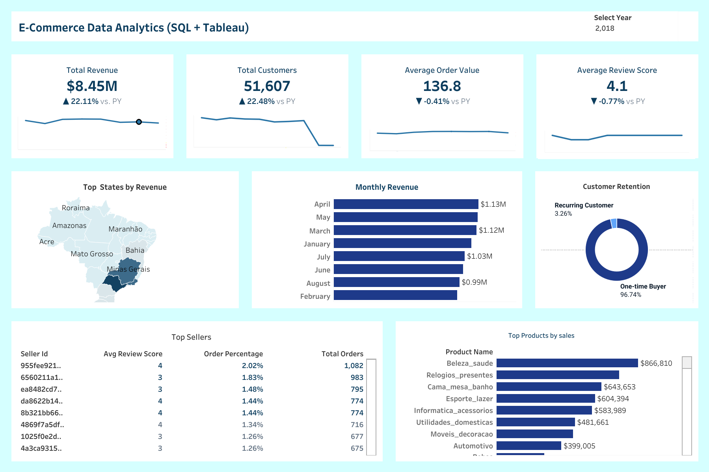

# Olist E-Commerce Analysis (2016–2018)

**Data Analytics Project — SQL • Tableau • PowerPoint**

---

##  Project Overview
This project analyzes three years of Olist e-commerce data to uncover insights about sales performance, customer behavior, delivery efficiency, and seller contribution.  
The goal is to support business decision-making through data-driven recommendations.

**Tools used:**  
- **SQL Server** — Data cleaning & analysis  
- **Tableau** — Dashboard visualization  
- **PowerPoint** — Business presentation

---

##  Business Questions Answered
- What are the top-selling product categories and states?  
- How do monthly and yearly sales trend over time?  
- What is the customer retention rate for the three years?  
- How do delivery delays impact customer satisfaction and review scores?  
- Which sellers contribute most to revenue and total orders?  
- What improvements can Olist make to drive growth?

---

##  Dashboard Preview

---

## 🔢 Key Metrics (KPIs)
- **Total Revenue**  
- **Average Review Score**  
- **Total Unique Customers**  
- **Customer Retention Rate**  
- **Average Delivery Time**  
- **Top States by Sales**  
- **Top Sellers by Revenue and Orders**

---

## 🛠️ Tools & Technologies
| Area | Tools |
|------|-------|
| Data Cleaning & Analysis | SQL Server |
| Visualization | Tableau |
| Presentation | PowerPoint |
| Version Control | GitHub |

---

## 🗂️ Folder Structure 
- [ SQL Query Script](./sql_scripts)
- [ Tableau Dashboard](./tableau_visuals)
- [Presentation](./presentation)
- [Data](./Data)

---

##  Insights Summary

### 1) Monthly Sales Trends
- Sales increased consistently from 2016 to 2018.  
- Holiday months show clear spikes.  
- 2018 recorded the highest revenue and order counts.

### 2) Top States by Revenue
- São Paulo and Rio de Janeiro are the strongest markets.  
- Southeastern states account for the majority of revenue.

### 3) Customer Retention
- Retention improved year-over-year (example: **0% → 9% → 17%**).  
- Repeat customers have higher average order values.

### 4) Top Sellers
- A small set of sellers contribute a large share of revenue.  
- High-rated sellers usually have faster delivery times.
  

##  Dashboard Link
**Tableau Public:** [View Dashboard on Tableau Public](https://public.tableau.com/views/olist1_17615850857480/Dashboard1?:language=en-GB&:sid=&:redirect=auth&:display_count=n&:origin=viz_share_link)  

##  Presentation / Video
- **PowerPoint (Slides):** `Presentation/Olist_Project_Presentation.pptx`  
- **5-minute video:** [Watch Video](#) *(replace `#` with your video link)*

##  Final Recommendations
1. Improve logistics in regions with high delivery delays.  
2. Introduce loyalty programs to grow repeat customers.  
3. Increase stock for top-selling categories.  
4. Highlight top sellers to boost conversion.  
5. Improve delivery communication during peak seasons.

---

## 🙋‍♂️ About Me
**Chukwuemeka Nnamani** — Data Analyst  
Email: [desmondnnamani.analytics@gmail.com](mailto:desmondnnamani.analytics@gmail.com)

LinkedIn: [Nnamani Desmond](https://www.linkedin.com/in/nnamani-desmond)

Portfolio Website: [View My Data Analytics Portfolio]

